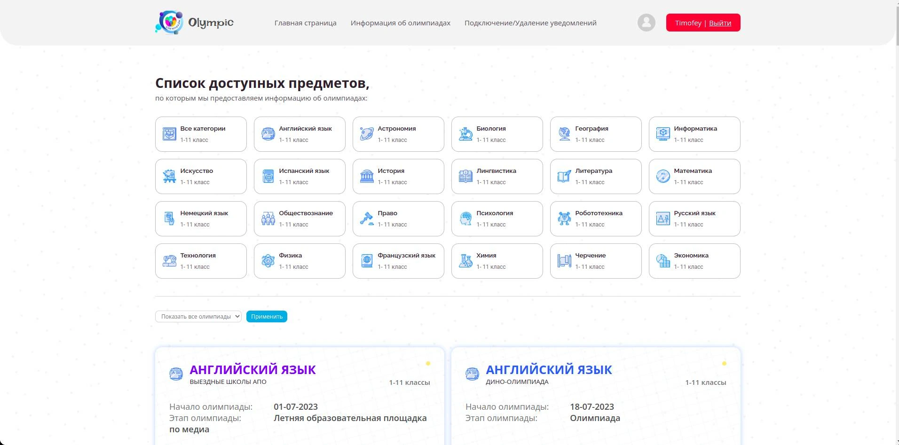
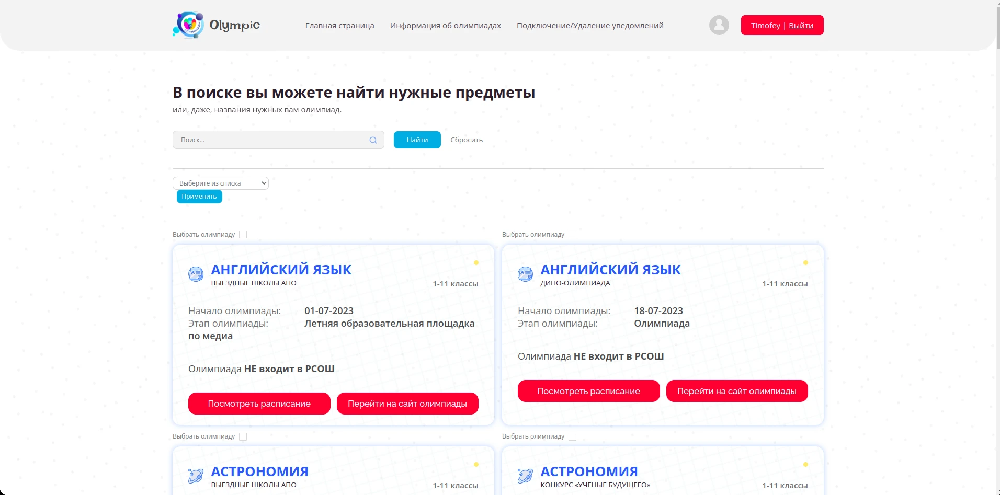

<h1 align="center">
   
  
   
  Olympic
   
</h1>

<h1 align="center">
   
  
  
</h1>

## О проекте
Программный комплекс для предоставления информации о школьных олимпиадах.

## Акутальность проекта

Актуальность моего проекта заключается в том, чтобы помочь и облегчить учащимся школ поиск информации об олимпиадах. Находясь на последней ступени школьного образования, я часто сталкиваюсь с проблемой, что многие ученики с довольно обширными знаниями в своих областях не находят этому реализации, не принимают участие в олимпиадах и тому есть ряд основных причин:
1. При обращении пользователя к обычным поисковым системам возвращается гигантское количество ссылок, что не обеспечивает приемлемого качества выборки. Дети не справляются с многообразием олимпиад, им сложно разобраться в олимпиадах и их уровнях, особенно это касается детей с гуманитарным складом ума.
2. Вторая объективная причина почему дети не принимают участие в олимпиадах, это забывчивость. Ни для кого не секрет, когда человек занимается любимым делом, он забывает про время, из-за чего нарушается режим. У 11-классника режим нарушается и из-за
большой нагрузки, время течет быстрее и все олимпиады пролетают мимо.
Поэтому ученикам нужен помощник, который отсортирует необходимые олимпиады и в нужное время напомнит о них. Это очень важно, человек, который занимается любимым делом, будет востребован, и его талант не зароется под грудой знаний, а реализуется в олимпиадах и принесет огромную пользу людям и нашей стране.

